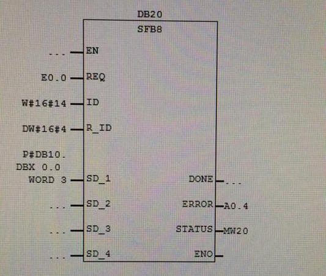
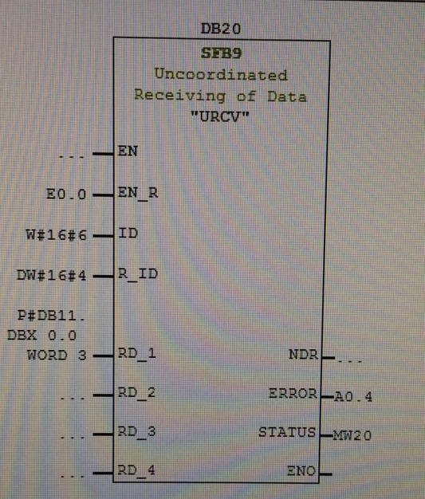

# Rapport RLI : connection avec SFB

## Etape de mise en communication des automates :

1. Retirer cable mauve de l'esclave.
2. Charger la matériel pour le *maitre* avec la **bonne** adresse MPI.
3. Débrancher la cable de *maitre* qui va vers le pc et connecter celui-ci du pc vers *l'esclave*
4. Charger la matériel pour *l'esclave* avec la **bonne** adresse MPI.
5. Aller dans MPI, connecter le 2 machines au cable *rouge*
6. Charger dans chaque machine.
7. Enjoy !

## Communication via SFB

1. Aller dans MPI et définir l'ID local et partenaire pour le *maitre* et *l'esclave*
2. Compiler et recharger dans chaque machine.
3. Les fonctions SFB (USEND,URVC, ...) se trouve dans :

	- selectionnée l'OB1
	- Bibliothèque
	- Standard Library
	- System Function Blocks

4. Au niveau de maitre(celui qui envoie les données) :

	- REQ : activer l'envoie
	- ID : id local de la machine
	- R_ID : l'id de la tâche qui doit être commune à *USEN* et *URCV*
	- SD_1 : donner envoié

5. Au niveau de l'esclave (celui qui revoit les données) :

	-EN_R : activer la réception
	-ID : id local de la machine
	-R_ID : l'id de la tâche qui doit être commune à *USEN* et *URCV*
	-RD_1 : l'endroit ou réceptionné les données

> exemple définition des IDs au niveau du MPI:

|ID local| ID partenaire|Machine|
|-----:|:------:|:----|
|6|14|esclave|
|14|6|maitre|

##Auteur :
- Antar Saliba
- De Buyst Nicolas
- Gramaglia Alexis