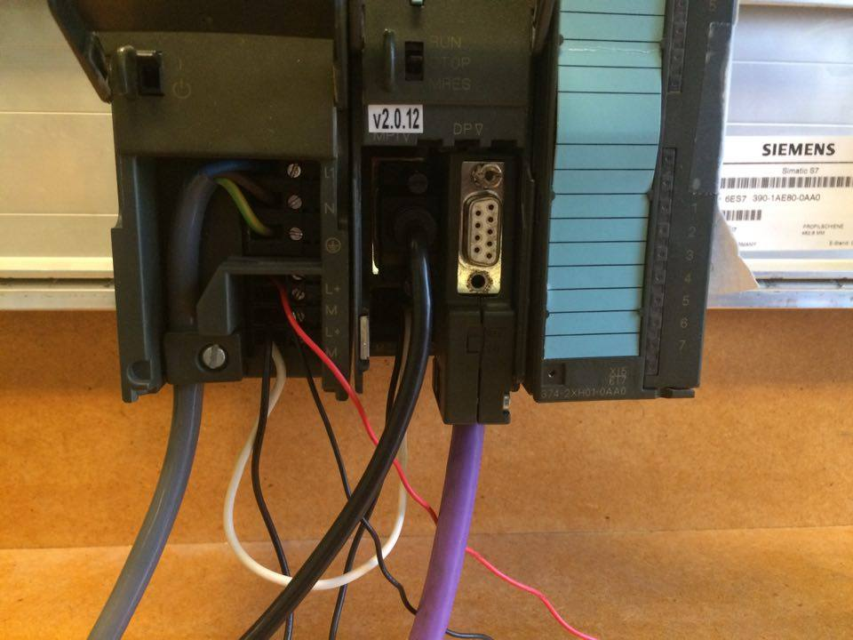
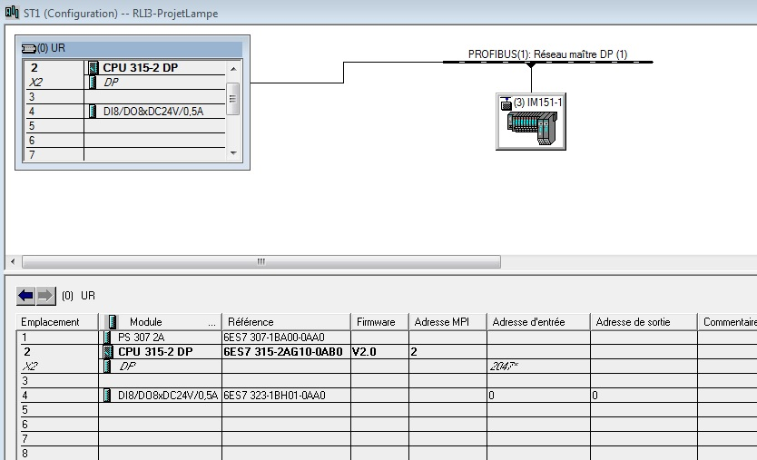
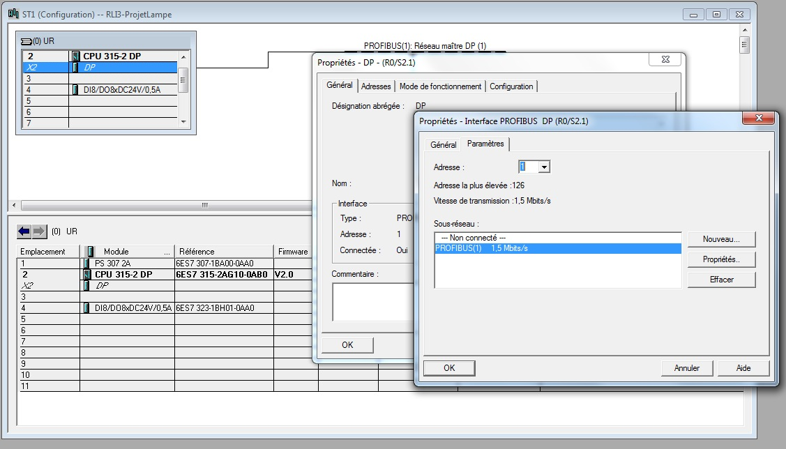
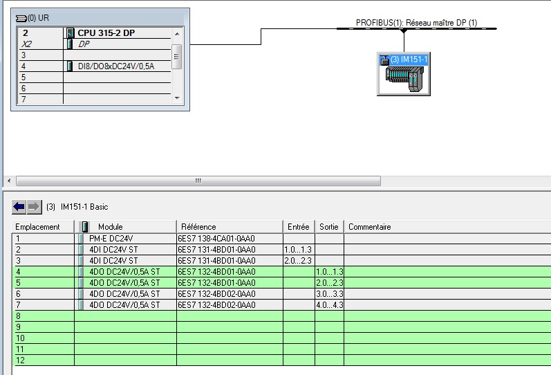
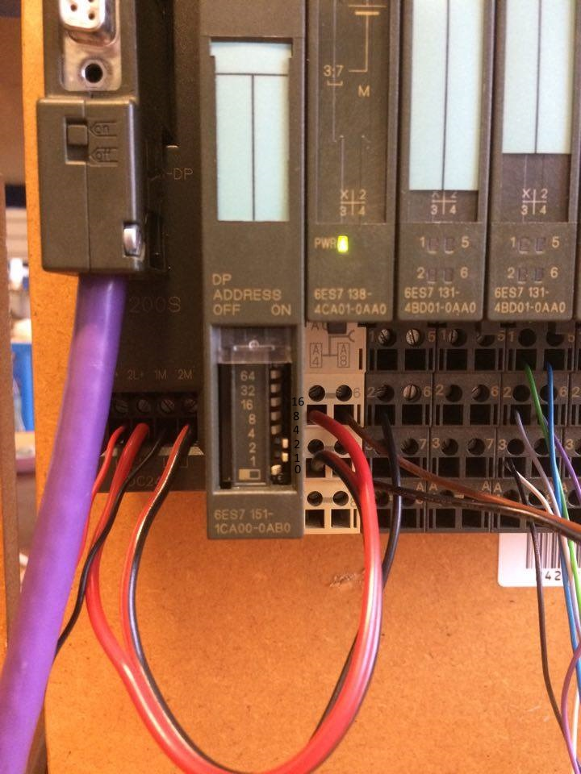
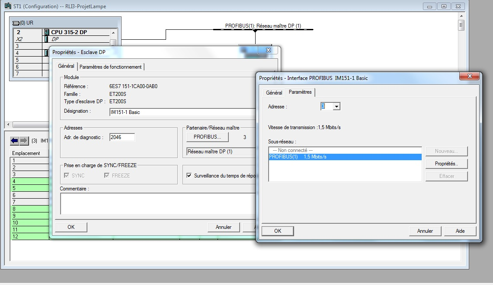

# RLI : connection profibus : les lampes
=======
## Ajout du matériel :

### Automate :

#### Câblage :

#### Configuration matériel :

#### Configuration adressage :

Lorsque l'on ajoute le *CPU315-2-DP*, il faut ajouter une adresse, on a mit **1**.

### ET200S :
#### Configuration matériel :
 
 

#### Configuration adressage :
Lorsque de l'on connecte l'*ET200S* *IM151-1 Basic*, il faut lui donner une adress, on a mit 3.
Car, sur l'*ET200S* il ya un "boitier" qui indique l'adresse de la machine et celui-ci indiquait **3**.

#### Changement d'adresse :
Il faut :

1. changer l'adresse au niveau de l'ET200 au niveau matériel
2. changer l'adresse  au niveau de la configuration matériel de l'ET200 dans STEP7
3. charger le matériel
4. eteindre l'automate
5. recharger le matériel 
6. enjoy! 

## Code :
