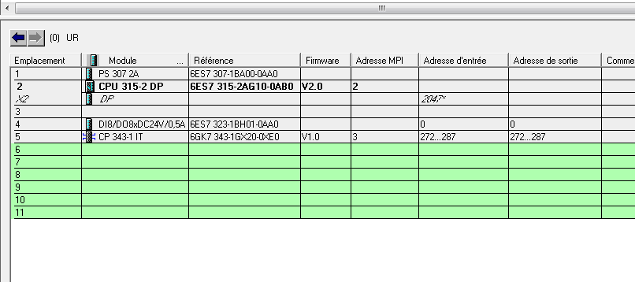
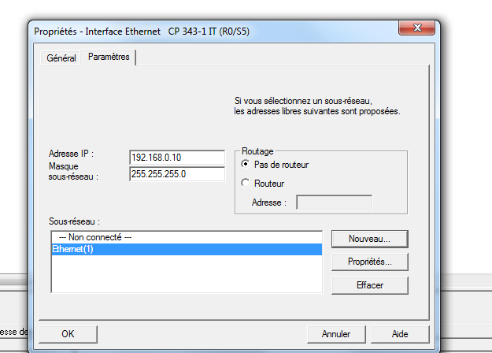
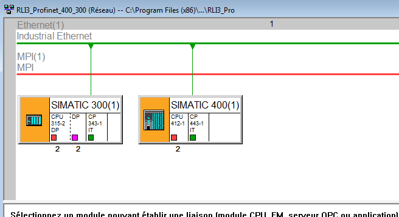
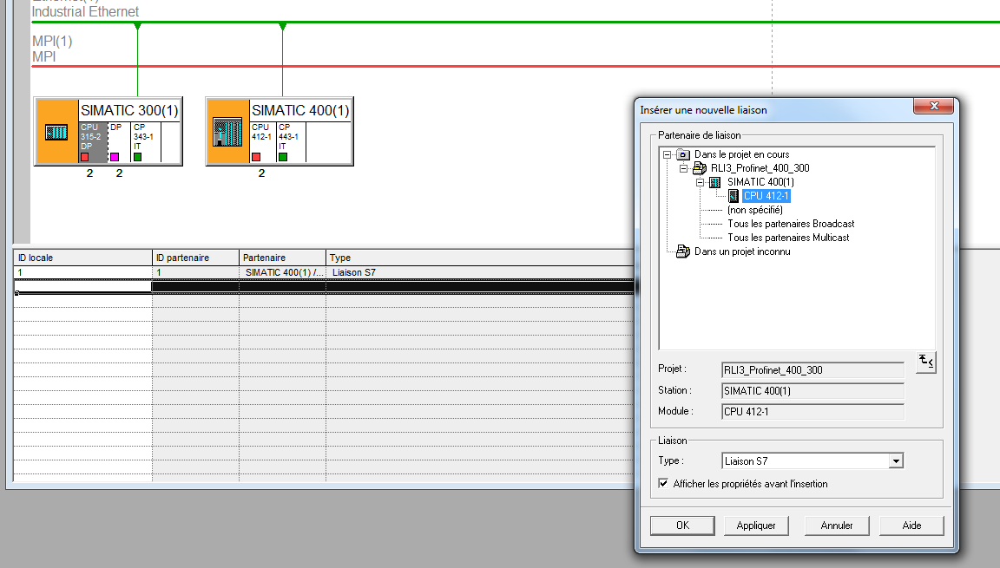
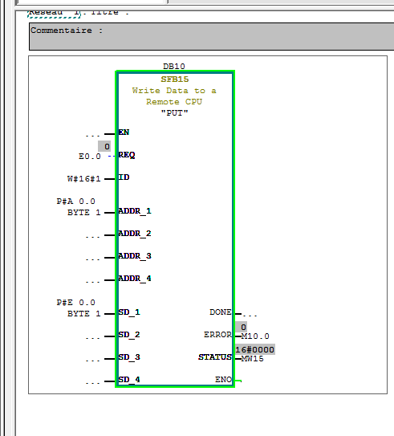

# S400 - S300 : profinet :
======================

## Configurer S400 :

- configuration "normal"
- lorsque l'on ajouter le *CP 443-1 Advanced-IT* 
	- il faut cliquer sur **nouveau** 
	- cliquer sur **OK**

- charge !

## Configurer S300 :
- changer le cable gris et le mettre dans le S300 
- configuration normal 
- 
- lorsque l'on rajouter le *CPU315-2-DP v2*, il ne faut rien configurer. Il faut directement cliquer sur *OK*
- pour le *SM374*, c'est -> *SM 323 DI8/D08xDC24V/0,5V*
- lorsque l'on rajoute le *CP 341-1 Advanced-IT* il faut selectionne le réseau que l'on a crée avant dans le *S400* et changer l'@IP du CP
- 
- charge 

## Configuration réseau 

- aller dans *MPI*
- connecter les 2 stations( les CP) au cable ethernet
- 
- mettre le cable gris sur le S400 charge le config dans S400
- changer le cable gris et cable sur S300
- charge dans S300
- cliquer la *CPU 315-2 DP* et double click sur l'ID 
	- 
	- liaison S7
	- mettre l'ID a 1
	- faire la meme manip pour le S400 avec le meme ID

puis recharger dans chaquqe machine

## Pet et get 
Ou ?

- Bibliotheque
- Standard lib
- System fonction bock
- Il faut choisir le *SFB15 PUT*

- *REG* : action qui transmet les infos
- *ID* : l'ID encode dans la laison MPI
- *ADDR_1* : l'adresse ou envoye les informations
- *SD_1* : les données que l'on veut envoyer sur *ADDR_1*

