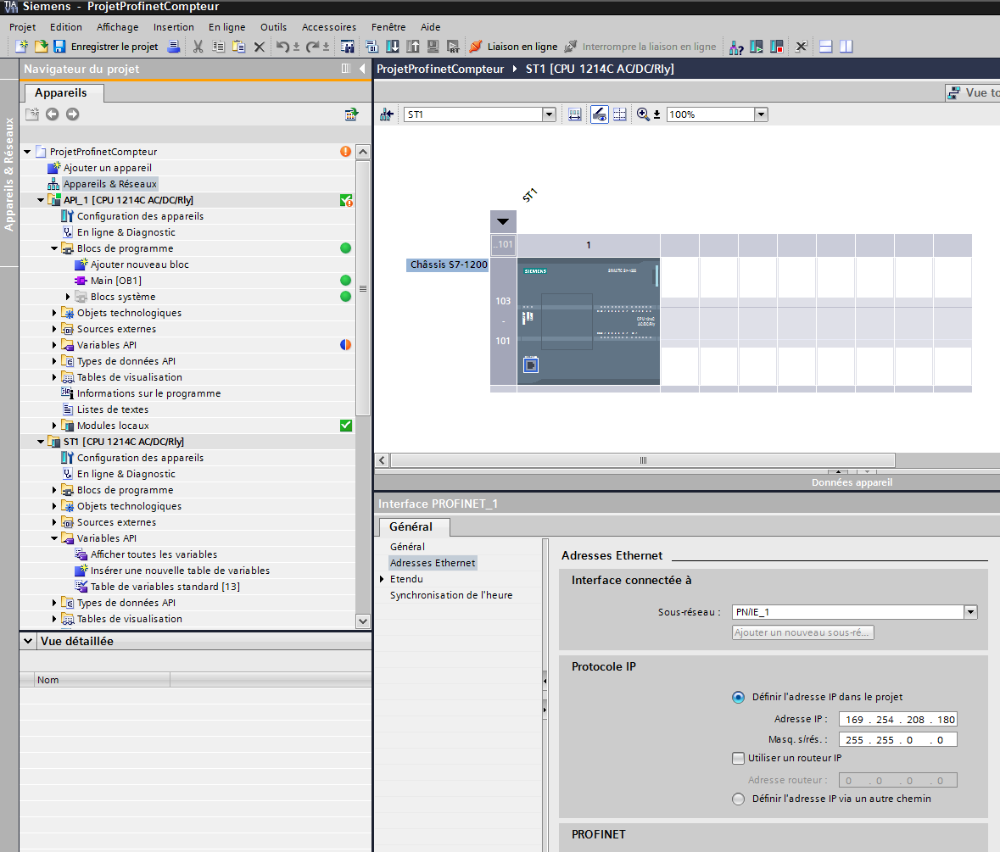
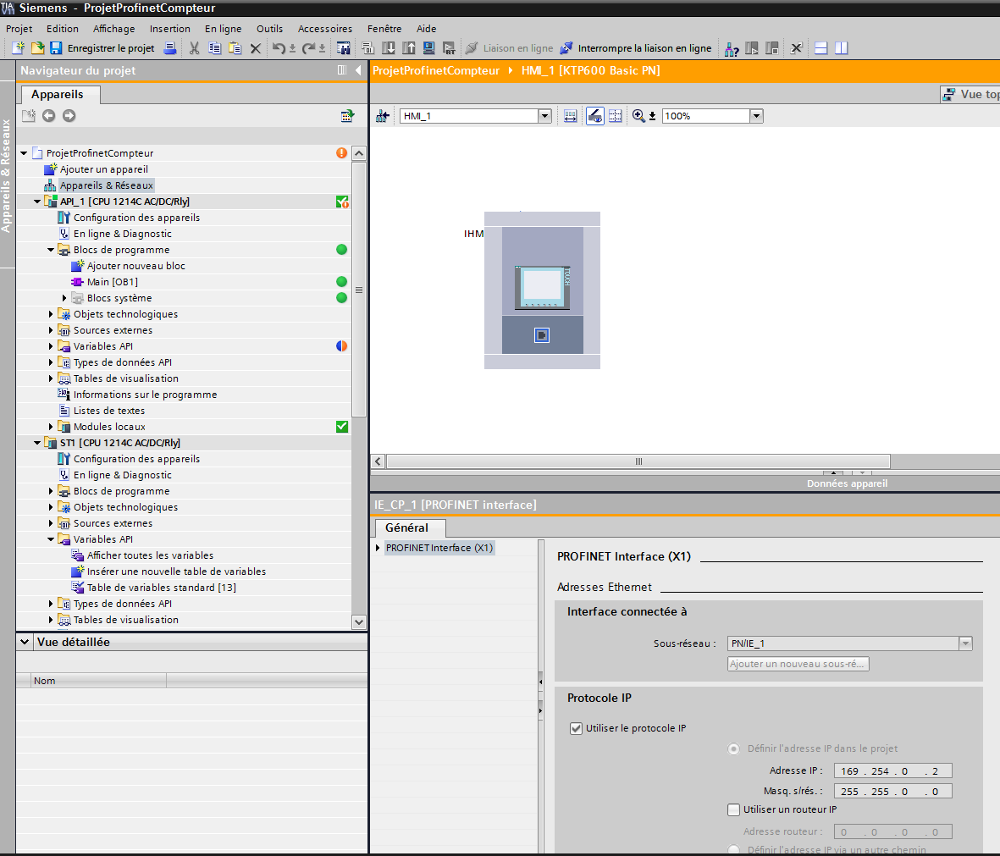
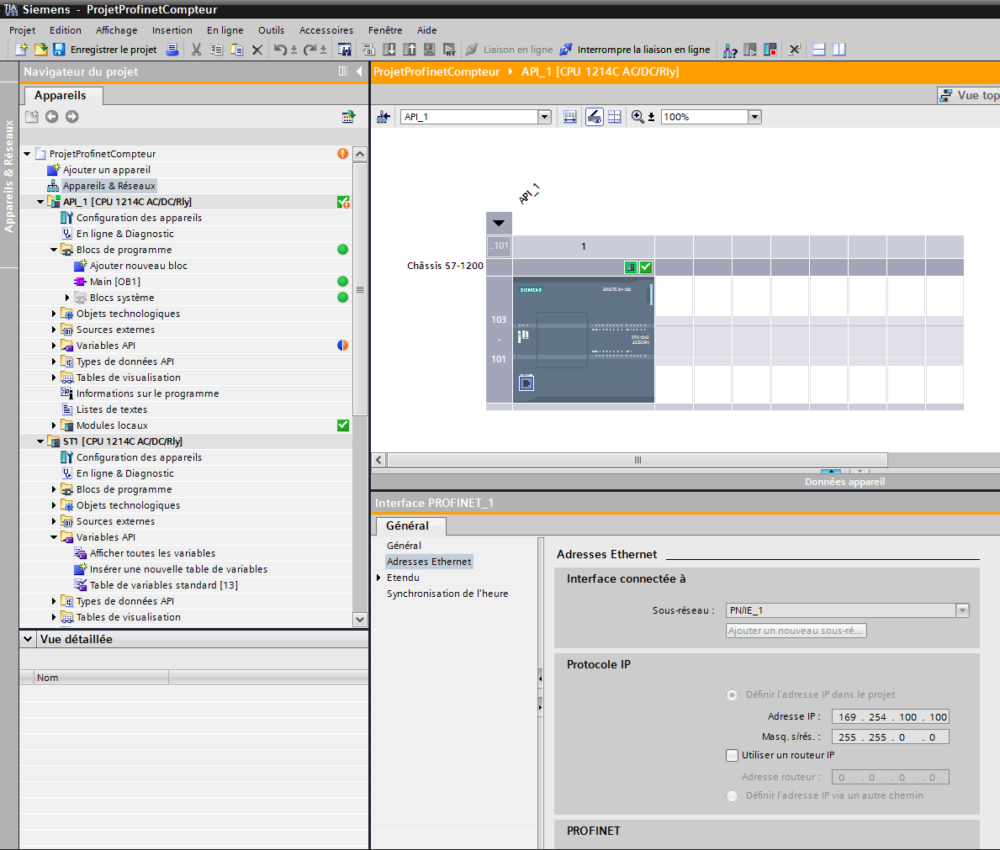
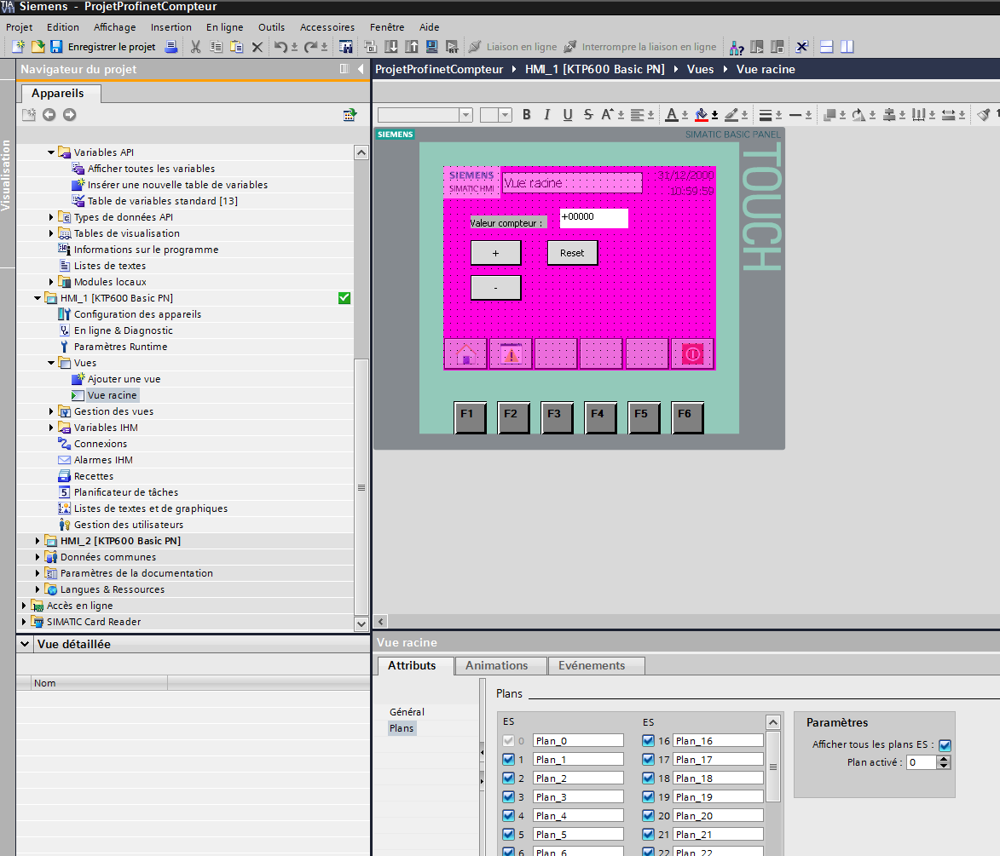
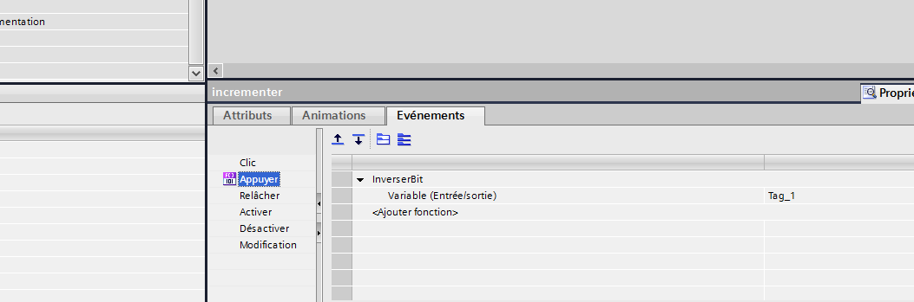
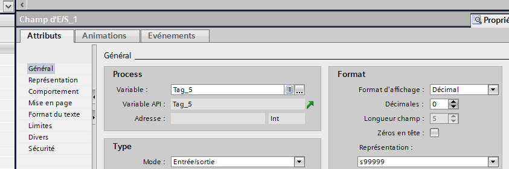
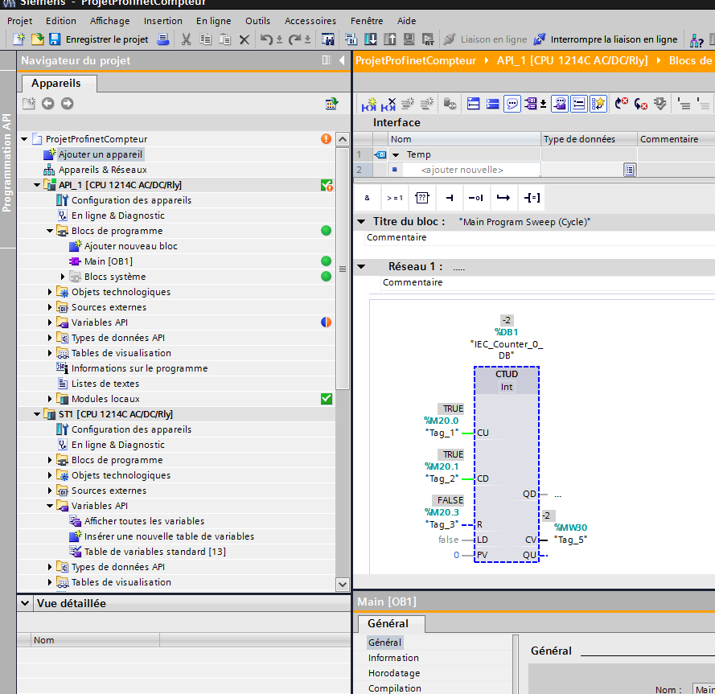

# RLI : S1200 profinet : compteur
===================================

## Ajouter la station avec l'affichage et bouton: (ST1)

!attention! : encoder les bonnes IP

### Ajouter IHM (IHM1)
!attention! : encoder les bonnes IP
IHM : Ecran 6' : KTP600 Basic PN

## Ajouter la station avec le compteur(ST2)
!attention! : encoder les bonnes IP
station : SIMATIC S7-1200 CPU 1214 AC/DC/RLY

### Ajouter IHM (IHM2)
!attention! : encoder les bonnes IP
IHM : Ecran 6' : KTP600 Basic PN

## Vue sur IHM1

## Réseau :

## Connecter les machines :

Il faut lié les prise ethernet au réseau et ce pour chaque machine

## Liaison des boutons avec variables
1. cliquer droit sur le bouton 
2. propriete 
3. evenement
4. appuyer
5. action : inverser bit
6. lié la variable a celle correspondante dans le ST2

##Connecter le label a la valeur de compteur
1. cliquer droit sur le bouton 
2. propriete 
2. dans générale 
3. section process
4. associe la bouton à la variable du compteur dans ST2

## Code OB1 de la ST2

## Put et Get
Les instructions put et get se trouver dans la section communication a gauche puis dans le dossier *communication S7*

image

##Problème rencontrer :

- Si les IHM ne sont pas reconnu et que l'Ip est correcte :
	+ quitter la vue la racine de IHM pour revenir sur la vue *loader*